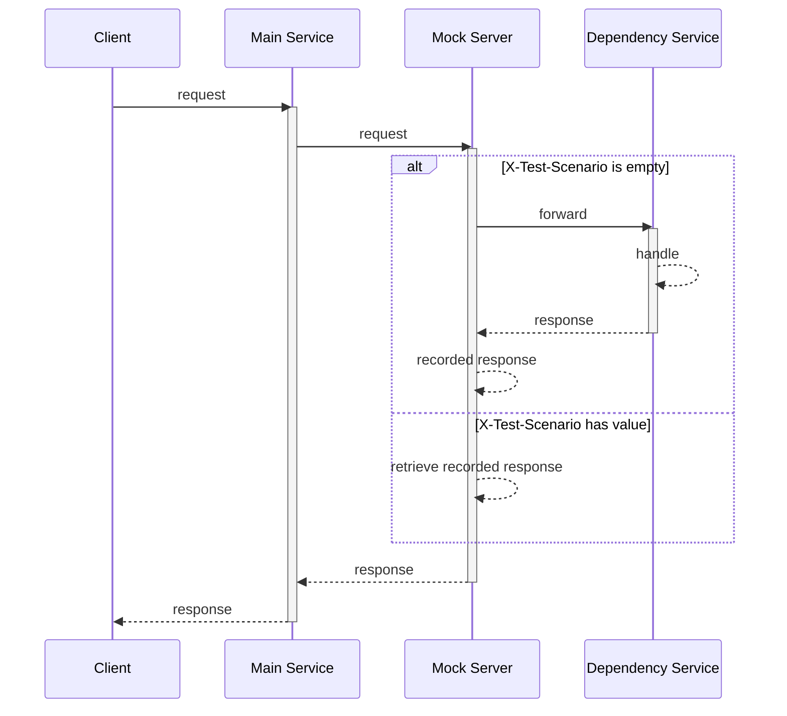

# Communication Flow

```mermaid
sequenceDiagram
    participant CLIENT as Client
    participant SVC as Main Service
    participant MOCK as Mock Server
    participant DEPENDENCY as Dependency Service
    
    CLIENT->>SVC: request
    activate SVC
    SVC->>MOCK: request
    activate MOCK
    
    alt X-Test-Scenario is empty
        MOCK->>DEPENDENCY: forward
        activate DEPENDENCY
        DEPENDENCY-->>DEPENDENCY: handle
        DEPENDENCY-->>MOCK: response
        deactivate DEPENDENCY
        MOCK-->>MOCK: recorded response
    else X-Test-Scenario has value
        MOCK-->>MOCK: retrieve recorded response
    end
    
    MOCK-->>SVC: response
    deactivate MOCK
    SVC-->>CLIENT: response
    deactivate SVC
```
